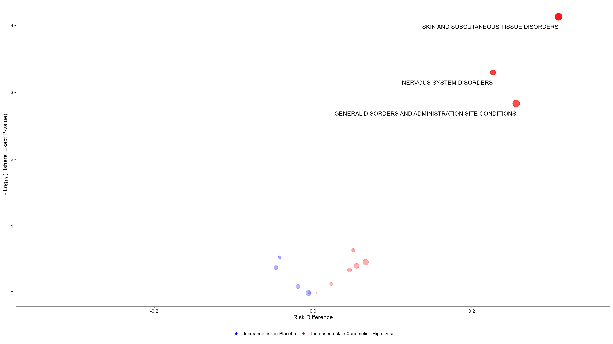
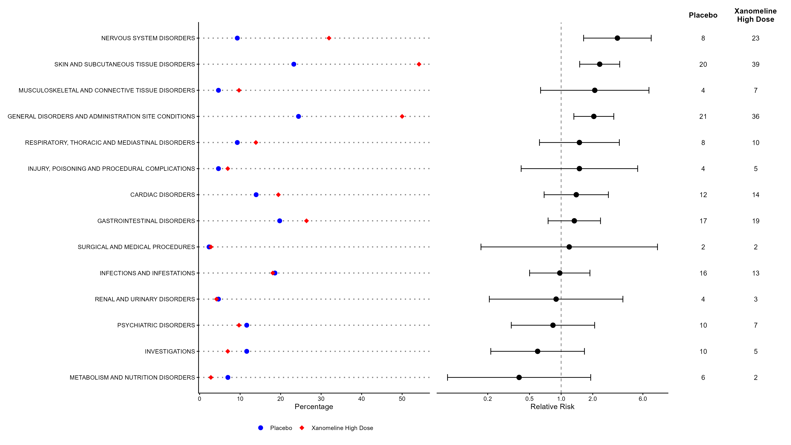

# Exploratory Data Visualizations
When I was working on Question 3, as I was toggling between different treatment arms, I started to wonder if there were better ways of comparing adverse events between treatment arms. I found an article which went over methods to visualize adverse event information and decided to try and replicate their plots using the `pharmaverseadam` dataset.

The article: Cornelius, V., Cro, S. & Phillips, R. Advantages of visualisations to evaluate and communicate adverse event information in randomised controlled trials. Trials 21, 1028 (2020). [https://doi.org/10.1186/s13063-020-04903-0]

## Plots comparing "Placebo" and "Xanomeline High Dose" arms
Volcano plot:

Dot plot:

